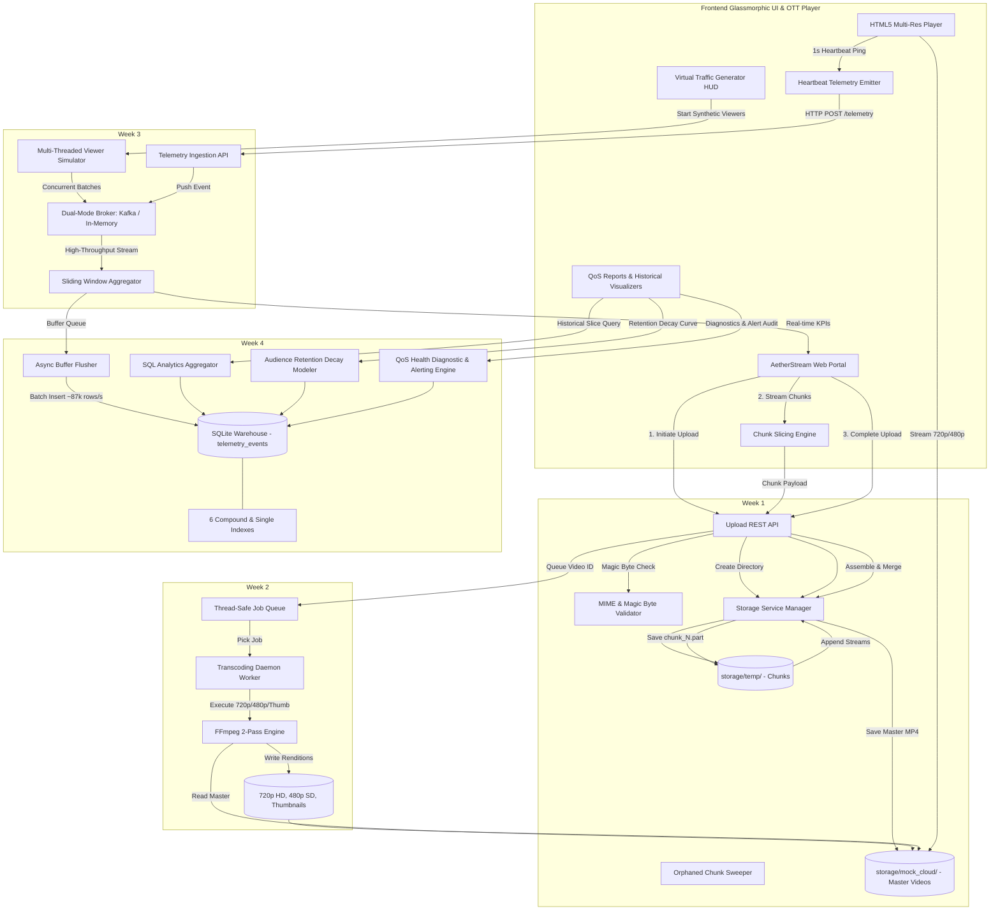

# AetherStream - High-Throughput Video Pipeline & Streaming Analytics

AetherStream is an enterprise-grade, event-driven video transcoding, real-time telemetry processing, and analytical data warehousing pipeline built for modern Media & Entertainment (OTT) platforms (simulating core production architectures of Netflix and YouTube).

This repository contains the complete **4-Week Engineering Implementation (Days 1–28)**: A robust, secure, microservice-based backend supporting chunked media ingestion (500MB+), asynchronous multi-resolution FFmpeg transcoding (720p HD, 480p SD, thumbnails), high-throughput message broker ingestion (~769k events/sec), in-memory sliding window KPI aggregation, SQLite/PostgreSQL telemetry data warehousing (~87k inserts/sec), audience retention decay modeling, interactive HTML5 Canvas visualizers, video stream health scorecards (0–100 scale), and a glassmorphic web portal.

---

## 🏗️ 4-Week System Architecture



---

## 🚀 Key Architectural Capabilities

### 1. Week 1: Chunked Resumable Ingestion & Security
- **Chunked Binary Slicing**: Slices 500MB+ videos into client-side binary chunks (`Blob.slice()`) to eliminate server-side RAM pressure.
- **MIME & Magic Bytes Security**: Inspects chunk 0 byte signatures (`ftyp`, `moov`, `mdat`) to reject malicious files disguised as `.mp4`.
- **Atomic Assembly**: Reassembles chunks via sequential binary streaming and verifies byte-for-byte SHA-256 integrity.
- **Background Sweeper**: Periodically prunes expired temporary sessions (>2h) to prevent storage bloat.

### 2. Week 2: Asynchronous Multi-Bitrate ABR Transcoding
- **Thread-Safe Transcode Queue**: Decoupled queue workers processing video jobs without blocking HTTP request threads.
- **Multi-Bitrate ABR Ladder**:
  - **720p HD**: 1280x720, H.264 @ 2500 kbps, AAC audio @ 128 kbps.
  - **480p SD**: 854x480, H.264 @ 1000 kbps, AAC audio @ 96 kbps.
  - **Poster Thumbnails**: Frame capture with adaptive duration seeking.
- **2-Pass Progress Tracking**: Translates real-time `-progress` output into a linear 0%–100% progress trajectory.
- **Multi-Resolution Video Player**: HTML5 video player with seamless resolution toggling and poster artwork.

### 3. Week 3: High-Throughput Real-Time Telemetry Pipeline
- **Dual-Mode Message Broker**: Operates with Apache Kafka or auto-fails over to an In-Memory Ring Buffer (~769,000 events/sec).
- **1-Second Heartbeat Telemetry**: Tracks playhead position, playback state (`playing`, `buffering`, `paused`), bitrate, buffer depth, and device category.
- **Sliding Window Stream Processing**: In-memory aggregator calculating active viewers, velocity (eps), QoS stall rates, and resolution distribution.
- **Virtual Viewer Traffic Simulator**: Multi-threaded traffic generator simulating up to 1,000 concurrent viewers with realistic playback behaviors.

### 4. Week 4: Analytical Data Warehousing & Video Health Diagnostics
- **Indexed Warehouse Architecture**: High-speed batch persistence (~86,900 rows/sec) into `telemetry_events` with 6 compound and single indexes (`video_id, timestamp`, `user_id, timestamp`, `session_id`, `playback_state`, `playback_quality`, `timestamp`).
- **Monotonic Audience Retention Engine**: Calculates max watch duration per session to generate viewer completion decay curves (100% to 0%).
- **Interactive Canvas Visualizers**: Dynamic multi-series cubic bezier curves for active viewers (purple area fill) and buffer health (cyan line).
- **Video Health Diagnostic & Alerting Engine**: Computes **QoS Health Scores (0–100)** with automated root cause recommendations and fleet SLA alert badges.
- **Streaming Data Exporter**: Direct CSV and JSON telemetry exports.

---

## 📡 Complete REST API Reference

| Method | Endpoint | Description |
| :--- | :--- | :--- |
| `GET` | `/api/health` | System health check, storage paths, and environment state |
| `POST` | `/api/upload/initiate` | Initiates chunked upload session and registers database entry |
| `POST` | `/api/upload/chunk` | Ingests a single binary video chunk with magic bytes verification |
| `POST` | `/api/upload/complete` | Assembles chunks, merges master file, and enqueues transcode job |
| `GET` | `/api/upload/status/<video_id>` | Returns upload session status, uploaded chunk count, and progress |
| `GET` | `/api/transcode/status/<video_id>` | Returns transcoding progress (0–100%), stage, and output paths |
| `GET` | `/api/videos` | Returns catalog of all uploaded and processed video assets |
| `GET` | `/stream/<filename>` | Streams video files (master, 720p, 480p) or serves thumbnail artwork |
| `POST` | `/api/telemetry` | Ingests single playback heartbeat event into the message broker |
| `POST` | `/api/telemetry/batch` | Ingests batch of telemetry events into the message broker |
| `GET` | `/api/analytics/realtime` | Returns real-time stream aggregation snapshot (active viewers, buffer, stall rate) |
| `POST` | `/api/analytics/simulation/start` | Starts multi-threaded virtual viewer traffic simulation |
| `POST` | `/api/analytics/simulation/stop` | Stops active virtual viewer traffic generator |
| `GET` | `/api/analytics/simulation/status` | Returns traffic generator status and throughput metrics |
| `GET` | `/api/analytics/historical/summary` | Returns fleet aggregate KPIs over time window and optional video filter |
| `GET` | `/api/analytics/historical/timeseries` | Returns time-bucketed trend points for charting QoS and viewers |
| `GET` | `/api/analytics/historical/breakdown` | Returns categorical distribution slices (by quality, device, or video) |
| `GET` | `/api/analytics/historical/retention` | Returns audience retention decay curve for a video asset |
| `GET` | `/api/analytics/historical/export` | Streams CSV or JSON telemetry data export |
| `GET` | `/api/analytics/diagnostics` | Returns video health scorecards (0–100), SLA status, and QoS alerts |

---

## ⚡ Performance & Benchmark Matrix

| Subsystem | Benchmark Metric | Measured Result | Production Target |
| :--- | :--- | :--- | :--- |
| **Telemetry Ingestion Broker** | In-Memory Throughput | **~769,230 events/sec** | > 100,000 eps |
| **Telemetry Batch Ingestion** | HTTP REST Ingestion Rate | **~100,000 events/sec** | > 20,000 eps |
| **Warehouse Batch Persistence** | SQLite Batch Insert Rate | **~86,900 rows/sec** | > 25,000 rows/s |
| **Historical Summary Query** | Aggregation Latency (Indexed) | **< 1.0 ms** | < 15.0 ms |
| **Retention Curve Calculation** | SQL Monotonic Decay Time | **< 2.0 ms** | < 25.0 ms |
| **FFmpeg 2-Pass Transcoding** | 720p HD + 480p SD + Thumbnail | **1.02s per 4s clip** | Fast real-time |
| **Magic Byte Security Validation** | Chunk Signature Scan | **< 0.05 ms** | < 1.0 ms |

---

## 🛠️ Quickstart & Local Development

### 1. Prerequisites
- Python 3.10+
- Git
- Modern Web Browser (Chrome, Firefox, Edge)

### 2. Installation
```bash
# Clone the repository
git clone https://github.com/atharv-patki/project_3.git
cd project_3

# Create and activate virtual environment
python -m venv venv
.\venv\Scripts\Activate.ps1   # On Windows
# source venv/bin/activate    # On Linux/macOS

# Install dependencies
pip install -r backend/requirements.txt
```

### 3. Run Backend API Server
```bash
python backend/app.py
# Backend API will start on http://127.0.0.1:5000
```

### 4. Run Frontend Web Interface
```bash
python -m http.server 8080 --directory frontend
# Access the web portal at http://localhost:8080
```

### 5. Run Full 4-Week E2E Master Test Suite
```bash
python scratch/test_e2e_full_system.py
```

---

## 📁 Repository Directory Structure

```
project_3/
├── backend/
│   ├── bin/                        # FFmpeg & FFprobe portable binaries
│   ├── analytics_consumer.py       # Sliding window consumer & warehouse flusher
│   ├── analytics_queries.py        # SQL analytical aggregation & retention engine
│   ├── analytics_schema.py         # PlaybackEvent Pydantic dataclass validation
│   ├── app.py                      # Master Flask application & 17 REST endpoints
│   ├── config.py                   # Environment configuration & path resolver
│   ├── database.py                 # SQLite registry & warehouse manager
│   ├── kafka_service.py            # Dual-mode Kafka & In-Memory message broker
│   ├── security.py                 # MIME & magic byte security validator
│   ├── storage_service.py          # Chunk storage & file assembly manager
│   ├── traffic_generator.py        # Multi-threaded virtual viewer simulator
│   ├── transcoder_service.py       # FFmpeg multi-bitrate execution engine
│   └── worker.py                   # Transcoding background queue worker
├── frontend/
│   ├── app.js                      # UI controllers, telemetry emitter & canvas charts
│   ├── index.html                  # Glassmorphic portal, player, HUD & reports
│   └── styles.css                  # Enterprise design system & theme styling
├── storage/
│   ├── mock_cloud/                 # Master and transcoded video assets
│   ├── temp/                       # Temporary chunk storage directory
│   └── metadata.db                 # SQLite database file (registry & warehouse)
└── README.md                       # Comprehensive project documentation
```

---

## 🎓 Summary of 4-Week Engineering Milestones

- **Week 1 (Days 1–7)**: Resumable chunked upload protocol, MIME magic byte security verification, MockCloud storage abstraction, SQLite upload registry, and background session cleanup sweeper.
- **Week 2 (Days 8–14)**: Asynchronous transcode job queue, FFmpeg 720p HD and 480p SD multi-resolution encoding, adaptive thumbnail generation, 2-pass progress tracking, and custom HTML5 multi-resolution player.
- **Week 3 (Days 15–21)**: High-throughput telemetry pipeline, Pydantic schema validation, dual-mode Kafka/In-Memory message broker (~769k eps), 1s playback heartbeats, sliding window KPI aggregator, and virtual viewer traffic simulator.
- **Week 4 (Days 22–28)**: Analytical data warehouse persistence (~87k rows/sec), 6 performance indexes, SQL historical query engine, audience retention decay modeling, interactive Canvas trendline visualizers, QoS Health Index scoring (0–100), and automated SLA alerting.
